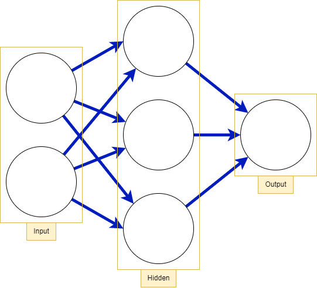
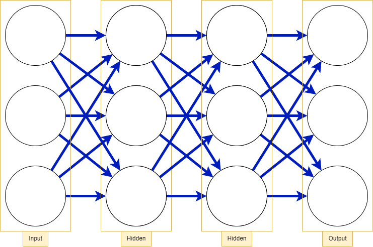
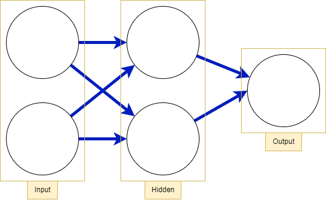
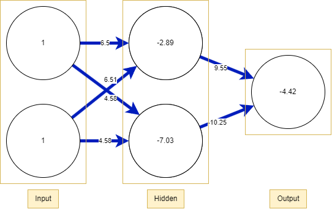

# About

This project is to explore the domain of AI and Machine Learning by showcasing an implementation of a Neural Network with backpropagation.

To follow along you'll need Poetry to install the dependencies.


### Prerequisite 

- Poetry

```bash
# Once you have Poetry you can install the dependencies with
poetry install
```

### Running
Running the scripts below will train and predict data.
- First is the XOR problem where it trains on the XOR logic table
- Second is data I got off the internet, I took a majority of the data to train and used the rest to predict with 94% accuracy if you train it enough times
```bash
poetry run python3 src/main.py
# or
poetry run python3 src/sonar.py
```

# What is a Neural Network?

Artificial Neural Networks (ANNs) are most commonly referred to as just Neural Networks (NNs), inspired by the brain and its structure. Like how neurons send signals to each other we can conceptually think of each neuron as a node in a node graph diagram.

<p align="center">
  </img>
  <h5 align="center">Figure 1.0</h5>
</p>

In Figure 1.0 we have a graph diagram of simple NN which can be divided into 3 layers.

***The input layer, the hidden layer, and the output layer.***

<p align="center">
  </img>
  <h5 align="center">Figure 1.1</h5>
</p>

<p align="center">
  </img>
  <h5 align="center">Figure 1.2</h5>
</p>

Here we look at 2 other NNs Figure 1.1 and Figure 1.2 and we can observe 2 things:  
1. There can be more than 1 hidden layer
2. There can be many nodes in each layer

> Things to note  
> If the NN is a regressor, then the output layer has a single node.
> 
> If the NN is a classifier, then it also has a single node unless softmax is used 
> in which case the output layer has one node per class label in your model.
> [[1]](#1)

Every hidden layer added decreases performace excluding some outliers, and the optimal number of hidden layers will depend on the usecase and the data. If the data is linearly separable then a hidden layer isn't even needed which will be explained later with the XOR problem.  

<p align="center">
  </img>
  <h5 align="center">Figure 1.3</h5>
</p>

In Figure 1.3 we have a trained neural network for the XOR problem which means this AI learned how to mimic a XOR gate by training on the inputs {(0,0), (0,1), (1,0), (1,1)}.

The way NNs work is by calculating the values inputted for example for (1,1):


## Forward Propagation

Forward Propagation is how we traverse the NN in otherwords how we give the AI some data and see what it thinks. For example in this NN we expect it to give us the output for a XOR gate.

1. For each node in the hidden layer we take the input layer node and multiply it by the weight then add it all up with the (input x weights) coming from other nodes
2. And then we add a bias to calculation now lets try this with our NN
3. From the first node: $(1*6.5) + (1*6.51) + (-2.89) = 10.12$
4. From the second node: $(1*4.58) + (1*4.58) + (-7.03) = 2.13$
5. Now after every node we add an activation function for reasons similar to the brain, if the neuron(node) doesn't light up enough it won't make as big of an impact
6. In this case we use a sigmoid function: $\sigma(10.12) = 0.99996$ and $\sigma(2.13) = 0.89379$
7. Now we just repeat this process for each layer
8. The output layer: $(0.99996*9.55) + (0.89379*-10.25) + (-4.42) = -4.032$
9. Finally we add the activation layer and we get 0 which is what we expect if we put (1,1) into a XOR gate


### Matrix Multiplication

Intuitively we can see that we can summarize all these calculations into matrix formulas. We can put the weights of each input node into the columns and the input nodes as another column maxtrix.

$A = 
  \begin{pmatrix}
  6.5 & 6.5 \\
  4.6 & 4.6 
  \end{pmatrix}
  \begin{pmatrix}
  1 \\
  1 
  \end{pmatrix}
  +
  \begin{pmatrix}
  -2.89 \\
  -7.03 
  \end{pmatrix}
$

$= 
  \begin{pmatrix}
  10.11 \\
  2.17 
  \end{pmatrix}
$

We also add the bias, and next is the activation function.

$\sigma(A) = 
  \begin{pmatrix}
  \sigma(10.11) \\
  \sigma(2.17) 
  \end{pmatrix}
$

$= 
  \begin{pmatrix}
  0.9999 \\
  0.893 
  \end{pmatrix}
$
## Back Propagation

Now we traverse backwards, but why? Well to train a NN we have to modify the numbers in the NN, first how do we know which direction the numbers need to go? Well we have the test data and what we expect it to be so we can calculate how close the AI was to the right answer. Then we use some calculas and move backwards adjusting the numbers along the way.


## References
<a id="1">[1]</a> 
doug (https://stats.stackexchange.com/users/438/doug), How to choose the number of hidden layers and nodes in a feedforward neural network?, URL (version: 2018-07-22): https://stats.stackexchange.com/q/1097
